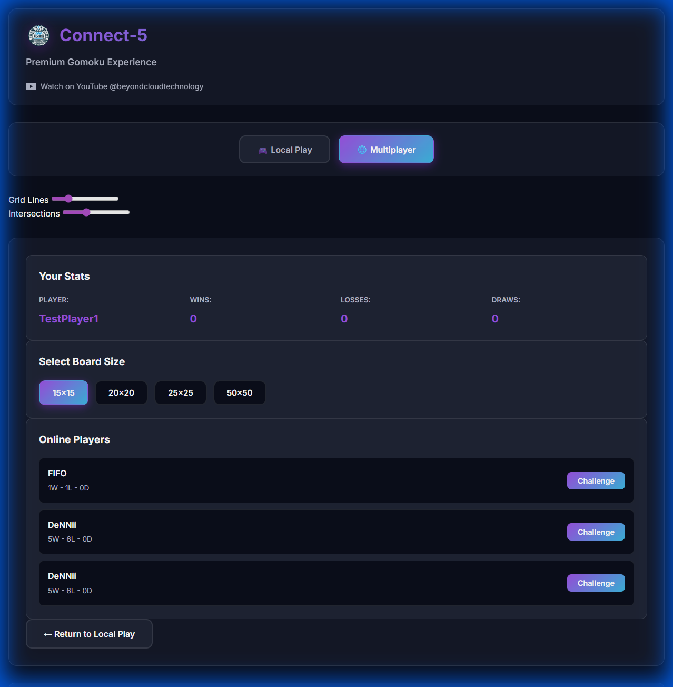
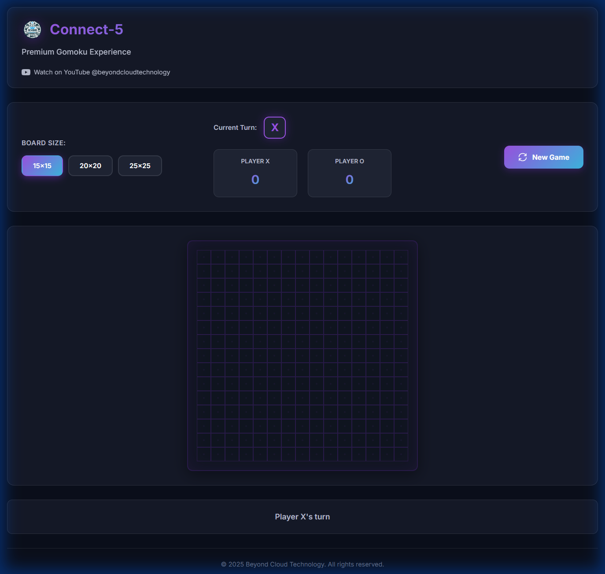
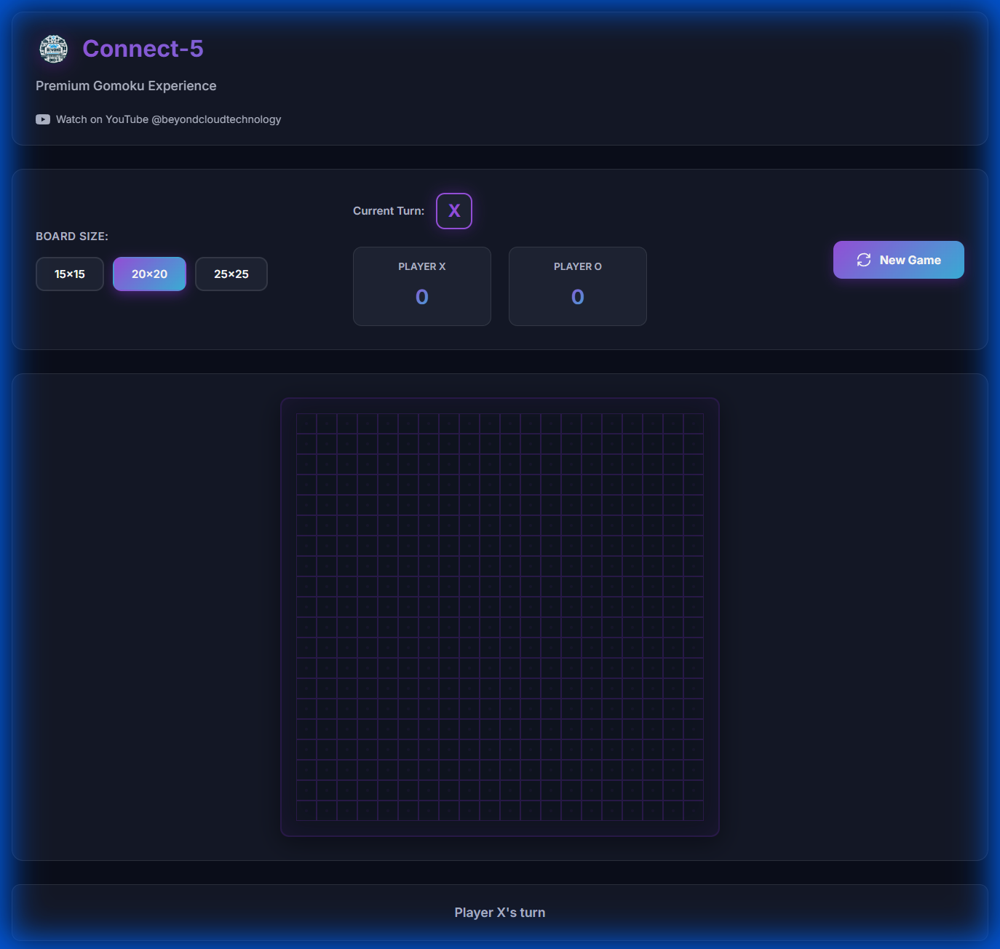
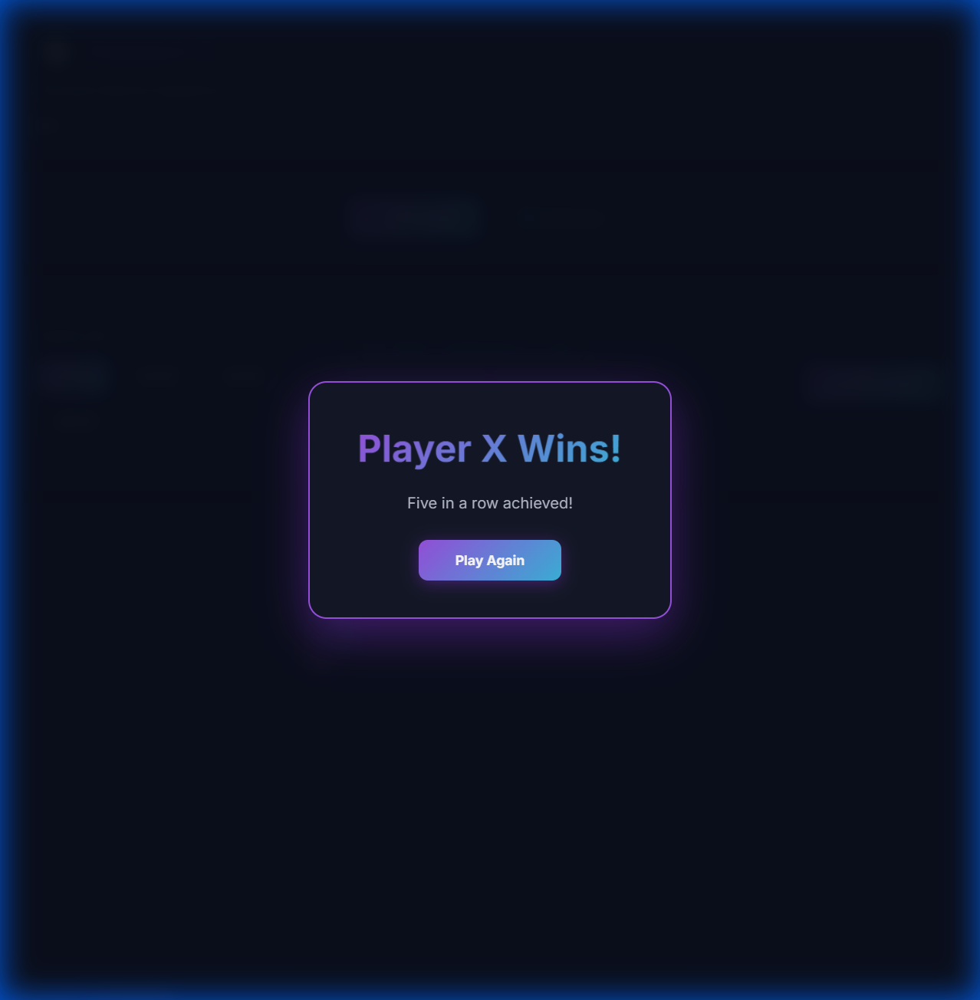
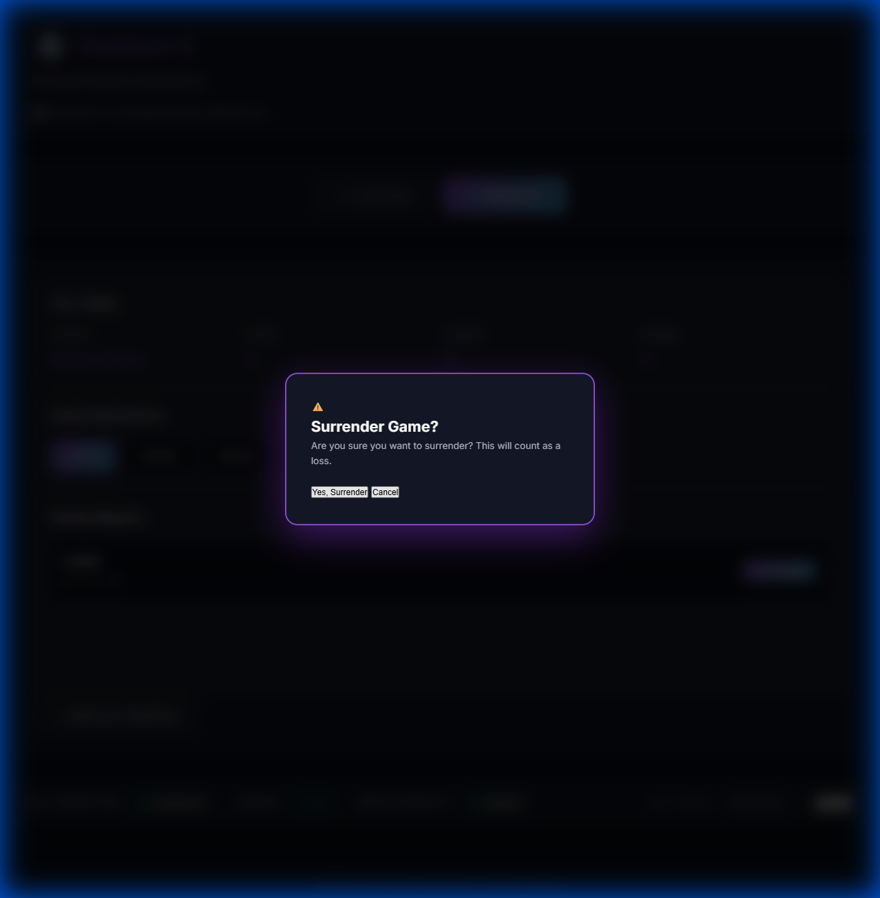

# Connect-5 🎮

<div align="center">

**Premium Real-Time Multiplayer Gomoku Game**

[](https://connect5.beyondcloud.technology/)

A beautiful, feature-rich implementation of the classic Connect-5 (Gomoku) game with real-time multiplayer support, built with modern web technologies.

[](https://nodejs.org/)
[](https://socket.io/)
[](https://postgresql.org/)

[Features](#-features) • [Visual Tour](#-visual-tour) • [How to Play](#-how-to-play) • [Deployment](#-deployment)

</div>

---

## ✨ Features

### 🌟 Visual Excellence (New!)
-   **Flash Last Move**: The most recent move pulses with a **neon glow** (2x brightness) for 2 seconds, making game flow instantly readable.
-   **Winning Highlight**: The 5 winning pieces are permanently highlighted with a victory animation.
-   **Customizable Visibility**: New **Grid & Dot Sliders** allow you to adjust board contrast in real-time.
-   **Graphing Paper Aesthetic**: Dark-themed, precision-grid design with glassmorphism UI elements.

### 🌐 Multiplayer Experience
-   **Real-Time Lobby**: See online players, challenge them instantly, and track their stats (Wins/Losses).
-   **Live Presence**: Notifications for challenges, accepts, and declines.
-   **Persistent Identity**: Username and stats are saved automatically.
-   **Reconnection Support**: Resume your game even if you accidentally refresh or lose internet briefly.

### 🎮 Gameplay Depth
-   **Multiple Board Sizes**: Choose from tight 15×15 tactical matches to epic 50×50 wars.
-   **Smart Controls**:
    -   **Surrender**: Gracefully bow out of a lost position.
    -   **Rematch**: Challenge the same opponent again instantly.
-   **Win Detection**: Full 8-direction detection algorithm with server-side validation.

---

## 📸 Visual Tour

<div align="center">

### Multiplayer Lobby
*Challenge players worldwide in real-time*


### Intense Local Play
*Smooth, responsive gameplay with new "Last Move Zoom"*


### Variable Board Sizes
*From standard 15x15 to massive 50x50 grids*


### Victory Celebration
*Clear winner announcement with move highlighting*


### Fair Play Features
*Surrender options and robust game state management*


</div>

---

## 🎮 How to Play

### Local Mode (Same Device)
1.  Select **"🎮 Local Play"**.
2.  Choose board size (Standard 15x15 recommended).
3.  Take turns placing X and O.
4.  First to get **5 in a row** (horizontal, vertical, or diagonal) wins!

### Multiplayer Mode (Online)
1.  Click **"🌐 Multiplayer"**.
2.  Enter a username.
3.  **Lobby**: Click "Challenge" next to any online player.
4.  **Accept**: When challenged, a notification appears—click Accept to start.
5.  **Play**: Moves are synced instantly (<50ms).

---

## 🚀 Deployment

The production environment runs on **Proxmox (TurnKey Node.js)** with a fully automated CI/CD pipeline.

### Production URL
**[https://connect5.beyondcloud.technology/](https://connect5.beyondcloud.technology/)**

### Automated Updates
The server checks GitHub every **5 minutes**.
-   **Push code**: `git push origin main`
-   **Wait 5 mins**: Server pulls, installs dependencies, and restarts automatically.

### Manual Deployment
```bash
# Force immediate update from Windows
.\deploy-remote.ps1
```

See [PROXMOX_DEPLOY_TEMPLATE.md](PROXMOX_DEPLOY_TEMPLATE.md) for full server setup details.

---

## 🛠️ Tech Stack

-   **Frontend**: Vanilla JS (ES6+), CSS3 Variables, Socket.io Client.
-   **Backend**: Node.js, Express, Socket.io.
-   **Database**: PostgreSQL (Stores games, moves, players).
-   **Infrastructure**: Proxmox LXC, Cloudflare Tunnel, Nginx.

---

<div align="center">
Made with 💜 by <strong>Beyond Cloud Technology</strong><br>
<a href="https://www.youtube.com/@beyondcloudtechnology">YouTube</a> • <a href="https://github.com/DeNNiiInc/Connect-5">GitHub</a>
</div>
